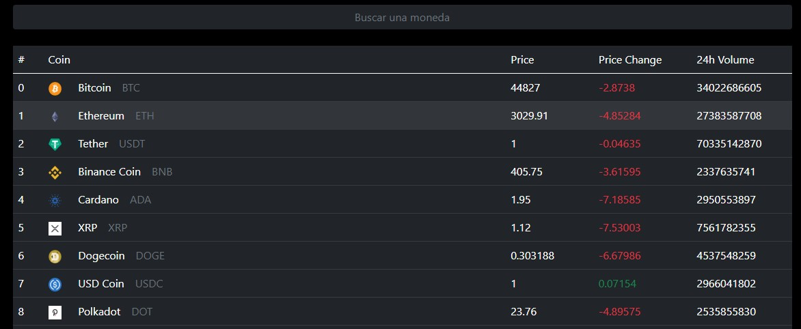

<h3>Buscador de precio de criptomonedas con Api de geckocoin.com</h3>

Dos componentes :
<ul>
  <li>TableCoins:para la tabla de las monedas</li>
  <li>CoinsRow:para las filas de la tabla</li>
  


Para la petición a la Api usé la biblioteca <strong> Axios</strong> y para que se ejecuten los datos inmediatamente cuando carga la aplicacion usé <strong>useEffect</strong> .
  
```
  
  const getData =  async () =>{
  const res= await axios.get("https://api.coingecko.com/api/v3/coins/markets?vs_currency=usd&order=market_cap_desc&per_page=100&page=1")
  console.log(res.data)
  setCoins(res.data) }
  useEffect(() =>{
    getData()
  },[] )
 
  ```
  
  La tabla la hice con las clases de **Bootstrap** ,
  primero usé el metodo <strong>map</strong> para que recorra cada objeto de la api y generé una fila por cada uno.Luego   usé las propiedades que tiene cada objeto(name,price,etc) y a travez de una funcion que contenga las propiedades(titles) que quiero mostrar ,coloque cada una en la cabecera de una columna.
  
  
  ``` 
            <td>{index}</td>
                <td>
                    
                    <span>{coin.name}</span>
                <span className="ms-3 text-muted text-uppercase" >{coin.symbol}</span></td>
            <td>{coin.current_price}</td>
            <td className={coin.price_change_percentage_24h > 0 ? 'text-success' : 'text-danger'}>
                    {coin.price_change_percentage_24h}</td>
            <td>{coin.total_volume}</td>   
  ```
  
  
  
  
  

